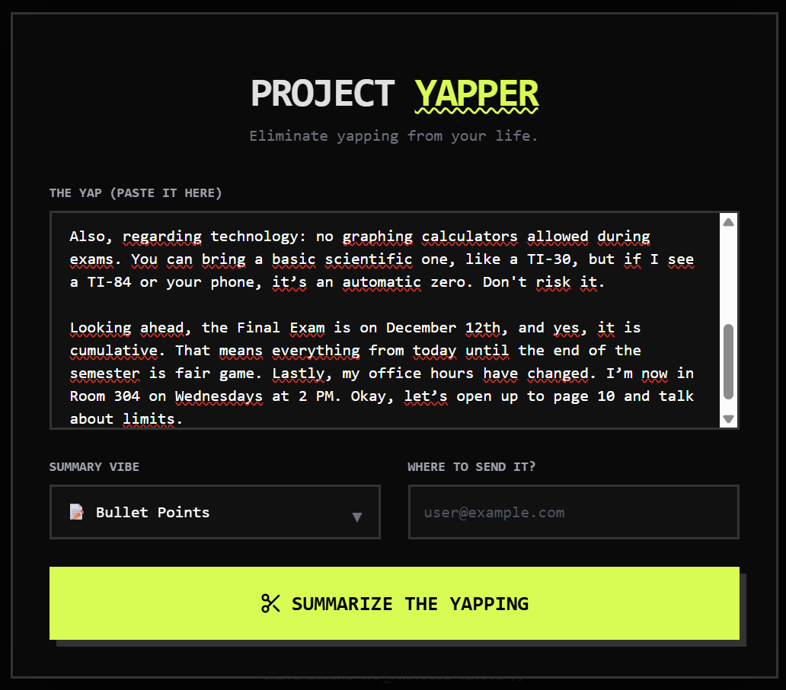
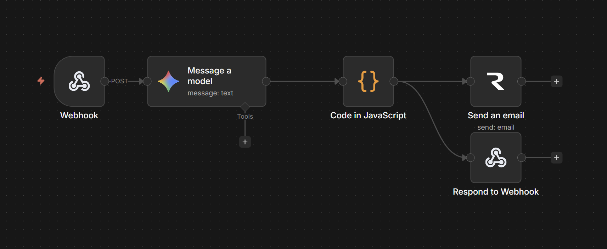
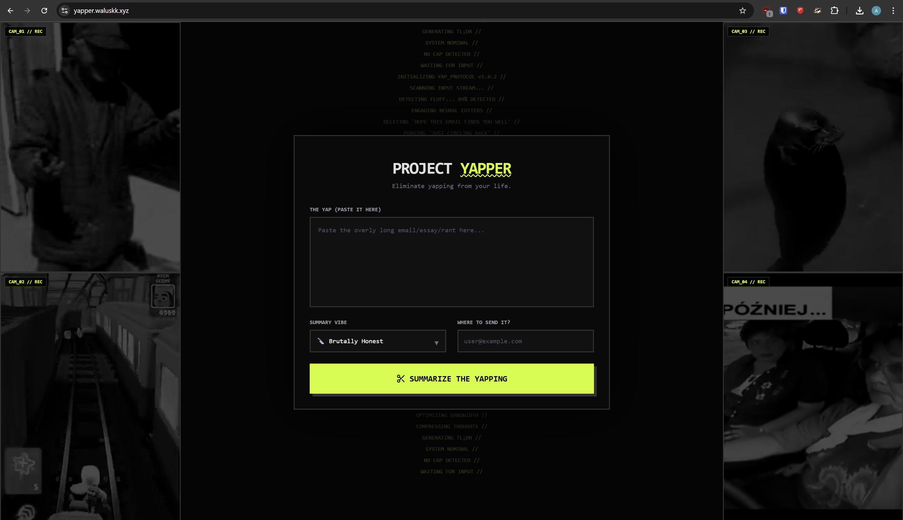

# Documentation: AI-Powered automated summarizer system

## Overview
**Project Name:** Project Yapper (AI-Summarizer)  
**Repository:** [https://github.com/waluskk/iit-final-project](https://github.com/waluskk/iit-final-project)  
**Live Deployment:** [https://yapper.waluskk.xyz](https://yapper.waluskk.xyz)

This document outlines the architecture, logic, and usage of the automated text summarization system. The project integrates a user-friendly frontend with a n8n backend automation to process and summarize large volumes of text using Google's AI model.

---

## Repetitive Task Being Automated

**The Problem:**
Processing long transcripts, extensive message logs, or massive text messages is a time-consuming and repetitive task.  
Manually reading through "walls of text" to extract key action items or summaries prevents users from focusing on higher-level decision-making.

**The Solution:**
This system automates the ingestion and synthesis of text. Instead of manual reading, the user provides the raw content, and the system automatically generates a concise, stylized summary.  
This reduces the time spent on information parsing from minutes (or hours) to seconds.

> ****
> *Example of the repetitive input data the system is designed to process*

---

## The Workflow Logic

The system follows a Client-Server architecture, utilizing **n8n** for backend.

### Step-by-Step Flow:
1.  **User Input:** The user navigates to the web interface and pastes the text they need to summarize.  
2.  **Webhook Trigger:** The frontend sends a `POST` request to the n8n backend via a **Webhook** node.  
3.  **AI Processing:** The workflow passes the text to the **"Message a model"** node. This node connects to the Google AI model to generate the summary.  
4.  **Data Parsing:** The **"Code in JavaScript"** node processes the AI's response, formatting the JSON data for delivery.  
5.  **Dual Output Delivery:**
    * **Email:** The **"Send an email"** node dispatches the summary to the user's provided email address.
    * **Frontend Response:** The **"Respond to Webhook"** node returns the summary to the website, displaying it immediately to the user.

> ****
> *The n8n automation graph showing the flow from Webhook -> AI Model -> Javascript Parsing -> Email & Response.*

---

## The Role of AI

The core intelligence of the system is driven by **Google's Generative AI Model** (Gemma/Gemini).

* **Intelligent Synthesis:** Unlike simple text analyzing algorithms, the AI model utilizes Language Processing to "read" the text and understand context.
* **Prompt Engineering:** The system uses a specific, fabricated prompt configured within the n8n node. This ensures the AI returns a summary in a specific style [e.g., professional, custom (slang), or bulleted] rather than a generic output.
* **Integration:** The AI serves as a data transformation step within the automation pipeline, converting unstructured text input into structured, meaningful insights.

> ****
> *The configuration panel for the AI model, showing the prompt logic used to style the output.*

---

## How the System Can Be Executed and Tested

The project is deployed on a live cloud environment and is accessible to the public.

### Infrastructure
* **Server:** DigitalOcean VPS
* **Operating System:** Ubuntu Linux
* **Deployment Method:** Docker Containerization

### Testing Instructions
To test the system functionality without local installation:

1.  **Access the Website:** Go to [https://yapper.waluskk.xyz](https://yapper.waluskk.xyz).
2.  **Input Data:** Paste a long segment of text (e.g., a news article or chat log) into the input field.
3.  **Run:** Click the submit button to trigger the backend automation.
4.  **Verify:**
    * **On-Screen:** The summary should appear on the webpage after a brief loading period.
    * **Email:** Check the inbox of the email address provided to confirm receipt of the summary.

> ****
> *Caption: The user interface displaying a successful summary response.*

>[Proofread by Gemini 3 PRO]